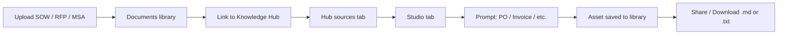

# Project documents → Knowledge Hub → Studio workflow

End-to-end guide for uploading project contract documents (SOW, RFP, MSA), linking them to a Knowledge Hub, generating deliverables in **Studio**, and sharing or downloading the results.

---

## Scenario overview



| Step | Where | What happens |
|------|--------|----------------|
| 1 | **Knowledge → Documents** | Upload project files (PDF, Word). One copy lives in the central library. |
| 2 | **Documents** (selection or row menu) | Link selected documents to one or more Knowledge Hubs. |
| 3 | **Knowledge Hub → Hub sources** | Confirm SOW/RFP appear as linked sources. |
| 4 | **Knowledge Hub → Studio** | Ask AI or use **Document** tool with a prompt such as *Generate purchase order* or *Create invoice*. |
| 5 | **Studio → Asset library** (right column) | New asset appears automatically — no separate save step. |
| 6 | **Asset drawer** | Copy content, **Download .md**, or **Download .txt**. Use **Share / Export** on the row to open the drawer. |

---

## Demo data in this prototype

On a fresh load (or after clearing `localStorage`), the app seeds:

- **Project Engagement Hub** — hub id `4`
- Three linked documents:
  - `Acme Platform Modernization — SOW v2.1.pdf`
  - `Acme Platform Modernization — RFP Response.docx`
  - `Acme Corp — Master Service Agreement.pdf`

Open **Knowledge → Knowledge Hubs → Project Engagement Hub → Studio** to try prompts immediately without uploading.

---

## Manual test checklist

### A. Upload and link

- [ ] Go to **Knowledge → Documents**
- [ ] Upload `sample-sow.md` and `sample-rfp-response.md` from this folder (or your own PDFs)
- [ ] Select both files → **Link to hub** → choose or create a hub
- [ ] Open the hub → **Hub sources** — both files listed with success status

### B. Generate assets in Studio

- [ ] Open **Studio** tab
- [ ] In **Ask AI**, enter: `Generate purchase order for milestone 1`
- [ ] Confirm toast “Saved to Studio” and asset appears in the library
- [ ] Repeat with: `Create invoice for Acme` and `Draft RFP response summary`

### C. Share and download

- [ ] Click the asset row or **Share / Export** (↗ icon)
- [ ] **Copy content** — paste into email or doc
- [ ] **Download .md** — file saves with markdown body
- [ ] **Download .txt** — plain-text export

### D. Hub-level share (optional)

- [ ] From hub list ⋯ menu or control center → **Share** opens **Share hub** dialog
- [ ] Add people/teams with viewer or editor access (members see Studio assets)

---

## Supported Studio prompts (project deliverables)

| Prompt example | Asset type | Output |
|----------------|------------|--------|
| Generate purchase order | Document | PO with line items from SOW milestones |
| Create invoice for Acme | Document | Invoice with bill-to and payment terms |
| Draft RFP response summary | Document | Executive summary aligned to RFP |

Other prompts still paths for summary, report, insight, presentation, mind map, flashcards, and data table.

---

## Sample upload files

Use the enclosed markdown files as stand-ins for PDF/Word during testing:

- [`sample-sow.md`](./sample-sow.md) — Statement of Work (Acme Platform Modernization)
- [`sample-rfp-response.md`](./sample-rfp-response.md) — RFP response excerpt

Upload these via **Documents → Add sources → From your computer**.

---

## Automated validation

Run the scenario script (no browser required):

```bash
node scripts/test-project-hub-scenario.mjs
```

This verifies demo seed data, hub linking, prompt classification, asset generation, and persistence shape.

---

## Known prototype limits

- Generation is **simulated** — outputs are structured templates grounded on hub source names, not live LLM extraction.
- Asset **Share** on the row opens export actions (copy/download), not email. Hub-level **Share hub** controls member access.
- Clearing browser storage removes uploads; demo seed rows re-merge on next load.
